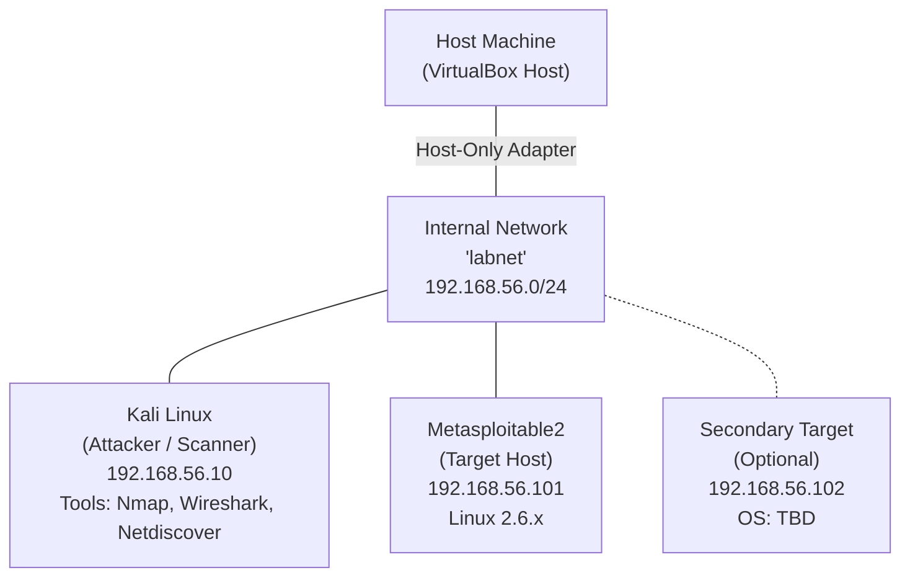

# Network Reconnaissance and Security Assessment

[](https://github.com/Meghana1826)
[](#)
[](#)
[](LICENSE)

A structured security assessment of an isolated lab network simulating the initial reconnaissance, enumeration, and risk identification phases of a penetration test within a virtualized sandbox environment.

---

## 📋 Table of Contents

- [1. Objective](#1-objective)
- [2. Scope](#2-scope)
- [3. Tools Used](#3-tools-used)
- [4. Lab Environment Setup](#4-lab-environment-setup)
- [5. Network Topology Diagram](#5-network-topology-diagram)
- [6. Methodology & Scan Results](#6-methodology--scan-results)
  - [6.1 Host Discovery](#61-host-discovery)
  - [6.2 Port & Service Enumeration](#62-port--service-enumeration)
  - [6.3 OS Fingerprinting](#63-os-fingerprinting)
  - [6.4 Traffic Analysis (Wireshark)](#64-traffic-analysis-wireshark)
- [7. Findings Summary](#7-findings-summary)
- [8. Risk Analysis & Recommendations](#8-risk-analysis--recommendations)
- [9. Conclusion](#9-conclusion)
- [📁 Project Structure](#-project-structure)
- [🚀 How to Run the Reconnaissance Script](#-how-to-run-the-reconnaissance-script)

---

## 1. Objective

The objective of this project is to assess the security posture of a lab network through systematic reconnaissance and enumeration techniques. The assessment simulates the initial phases of a penetration test — discovery, enumeration, and risk identification — carried out entirely within an isolated virtual lab environment.

---

## 2. Scope

- **Host discovery and network mapping**
- **Port and service enumeration**
- **Operating system fingerprinting**
- **Identification of exposed services and associated risks**

---

## 3. Tools Used

| Tool | Purpose / Category |
| :--- | :--- |
| **Kali Linux** | Attacker / scanning platform |
| **Nmap** | Port scanning, service detection, OS fingerprinting |
| **Wireshark** | Packet capture and traffic analysis |
| **Netdiscover** | ARP-based host discovery |

---

## 4. Lab Environment Setup

The lab was built using **VirtualBox** with all virtual machines connected via an **Internal Network** adapter (`labnet`, `192.168.56.0/24`), isolating the lab from the host machine's real network and the internet. This ensures all scanning activity is confined to machines under the tester's own control.

* **Kali Linux (`192.168.56.10`)** — Attacker / scanner machine
* **Metasploitable2 (`192.168.56.101`)** — Intentionally vulnerable target host

---

## 5. Network Topology Diagram



---

## 6. Methodology & Scan Results

### 6.1 Host Discovery

**Netdiscover** was used to identify live hosts on the lab subnet via ARP requests:

```bash
$ sudo netdiscover -r 192.168.56.0/24

Currently scanning: Finished! | Screen View: Unique Hosts
2 Captured ARP Req/Rep packets, from 2 hosts. Total size: 120
_____________________________________________________________________
 IP             At MAC Address     Count Len MAC Vendor
----------------------------------------------------------------------
 192.168.56.101 08:00:27:4a:1b:2c  1     60  Cadmus Computer Systems
 192.168.56.1   0a:00:27:00:00:00  1     60  Unknown vendor
```

Findings were confirmed with an **Nmap ping sweep**:

```bash
$ nmap -sn 192.168.56.0/24

Nmap scan report for 192.168.56.101
Host is up (0.00042s latency).
Nmap done: 256 IP addresses (2 hosts up) scanned in 2.14 seconds
```

---

### 6.2 Port & Service Enumeration

A full TCP port scan was performed against the identified target:

```bash
$ nmap -p- -T4 192.168.56.101

PORT     STATE SERVICE
21/tcp   open  ftp
22/tcp   open  ssh
23/tcp   open  telnet
25/tcp   open  smtp
80/tcp   open  http
139/tcp  open  netbios-ssn
445/tcp  open  microsoft-ds
3306/tcp open  mysql
5432/tcp open  postgresql
8180/tcp open  unknown
```

Service and version detection was then run against the open ports:

```bash
$ nmap -sV -sC -p21,22,23,25,80,139,445,3306,5432,8180 192.168.56.101

PORT     STATE SERVICE     VERSION
21/tcp   open  ftp         vsftpd 2.3.4
22/tcp   open  ssh         OpenSSH 4.7p1 Debian 8ubuntu1 (protocol 2.0)
23/tcp   open  telnet      Linux telnetd
25/tcp   open  smtp        Postfix smtpd
80/tcp   open  http        Apache httpd 2.2.8 ((Ubuntu) DAV/2)
139/tcp  open  netbios-ssn Samba smbd 3.X
445/tcp  open  netbios-ssn Samba smbd 3.X
3306/tcp open  mysql       MySQL 5.0.51a-3ubuntu5
5432/tcp open  postgresql  PostgreSQL DB 8.3.0 - 8.3.7
```

---

### 6.3 OS Fingerprinting

```bash
$ sudo nmap -O 192.168.56.101

Running: Linux 2.6.X
OS CPE: cpe:/o:linux:linux_kernel:2.6
OS details: Linux 2.6.9 - 2.6.33
Network Distance: 1 hop
```

The OS fingerprint was cross-validated using the TTL value observed in ICMP replies (`TTL ~64`, consistent with a Linux-based host).

---

### 6.4 Traffic Analysis (Wireshark)

A packet capture was taken on the Kali interface during the Nmap SYN scan. The capture showed the expected TCP three-way handshake behavior: **SYN packets** sent to each target port, with **SYN-ACK responses** from open ports and **RST responses** from closed ports. This confirmed the accuracy of the Nmap port-state results at the packet level.

---

## 7. Findings Summary

| Host (IP) | Operating System | Open Ports | Service / Version | Risk Level |
| :--- | :--- | :--- | :--- | :--- |
| **192.168.56.101** | Linux 2.6.x (Ubuntu-based) | 21, 22, 23, 25, 80, 139, 445, 3306, 5432, 8180 | vsftpd 2.3.4, OpenSSH 4.7p1, Telnetd, Apache 2.2.8, Samba 3.x, MySQL 5.0.51a | **High** |
| **192.168.56.10** | Kali Linux (Rolling) | N/A (scanner host) | N/A | **N/A - Attacker Machine** |

---

## 8. Risk Analysis & Recommendations

| Finding | Affected Service | Impact | Recommendation |
| :--- | :--- | :--- | :--- |
| **Outdated FTP service with known backdoor** | `vsftpd 2.3.4` (port 21) | Remote attacker could gain shell access via a known backdoor in this version | Upgrade to a patched vsftpd release; disable anonymous FTP; restrict access by firewall |
| **Telnet enabled (cleartext protocol)** | `Telnetd` (port 23) | Credentials and session data transmitted unencrypted, vulnerable to sniffing | Disable Telnet; use SSH exclusively for remote administration |
| **Outdated SSH daemon** | `OpenSSH 4.7p1` (port 22) | Older version affected by multiple known CVEs including user enumeration | Upgrade OpenSSH to the latest stable release; enforce key-based authentication |
| **Legacy SMB/Samba exposure** | `Samba 3.x` (ports 139, 445) | Vulnerable to known remote code execution exploits in this version range | Patch or upgrade Samba; restrict SMB access to trusted hosts only |
| **Database service exposed to network** | `MySQL 5.0.51a` (port 3306) | Direct network exposure increases risk of brute-force or credential attacks | Bind MySQL to localhost only, or restrict via firewall rules; enforce strong credentials |
| **Unencrypted web service** | `Apache 2.2.8` (port 80) | Outdated version with known vulnerabilities; no TLS in use | Upgrade Apache; enforce HTTPS with a valid TLS certificate |

---

## 9. Conclusion

The assessment identified a target host running numerous outdated and misconfigured services, several of which carry well-documented vulnerabilities including remote code execution and cleartext credential exposure. In a production environment, these findings would represent a **critical risk profile**. 

Recommended remediation includes upgrading all identified services to current patched versions, disabling unencrypted legacy protocols such as Telnet, and applying network segmentation and firewall rules to reduce the exposed attack surface.

---

## 📁 Project Structure

```text
cybersecurity-minor-project/
├── docs/
│   ├── Cyber_Security_Minor_Project.pdf   # Complete project report PDF
│   └── Cyber_Security_Minor_Project.docx  # Editable Word document
├── scans/
│   ├── netdiscover_scan.txt               # Netdiscover ARP discovery output
│   ├── nmap_full_scan.txt                 # Nmap full port & service detection log
│   └── nmap_os_detection.txt              # OS fingerprinting output
├── scripts/
│   └── recon_scanner.sh                   # Automated reconnaissance scan script
└── README.md                              # Main documentation & findings report
```

---

## 🚀 How to Run the Reconnaissance Script

1. **Clone the repository**:
   ```bash
   git clone https://github.com/Meghana1826/cybersecurity-minor-project.git
   cd cybersecurity-minor-project/scripts
   ```

2. **Make the script executable**:
   ```bash
   chmod +x recon_scanner.sh
   ```

3. **Execute scanner on Kali Linux**:
   ```bash
   sudo ./recon_scanner.sh
   ```
